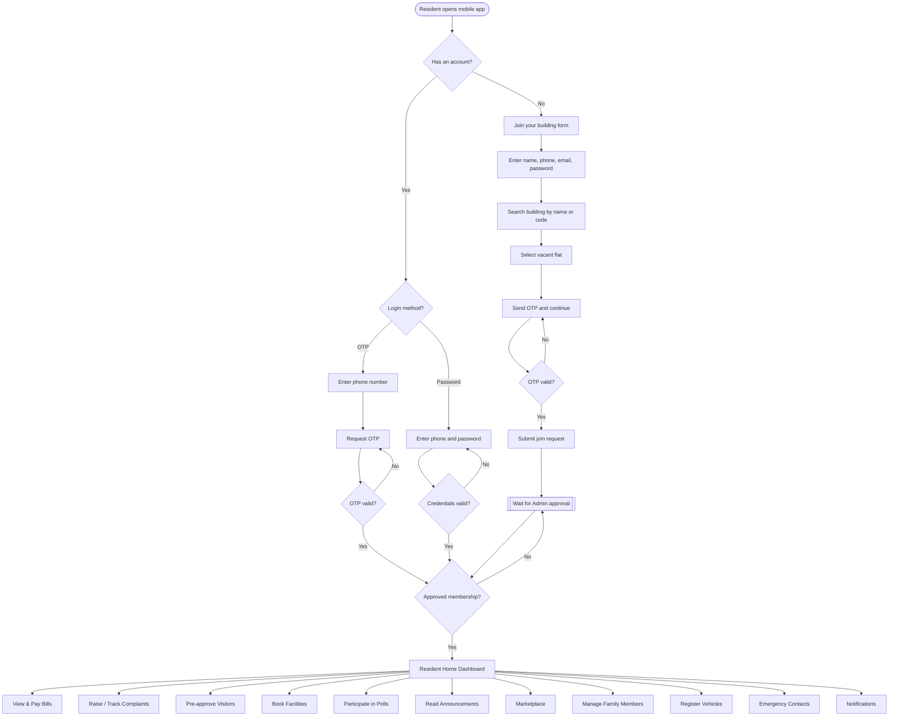
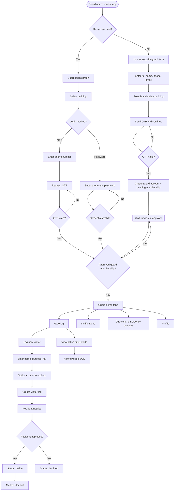
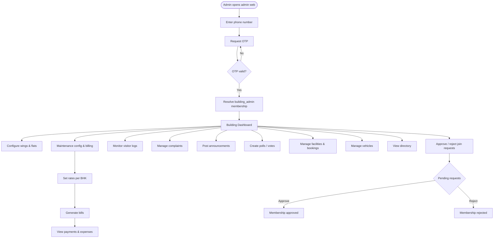
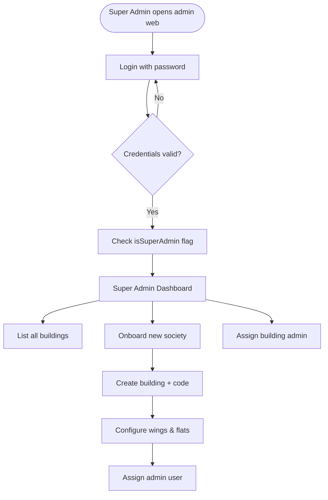

# FLATBRIZ — High-Level Architecture Document (HLAD)

| Field | Value |
| --- | --- |
| **Product** | FLATBRIZ (society / building management platform) |
| **Status** | Living architecture overview — reflects current codebase |
| **Audience** | Engineering, tech leads, onboarding developers |
| **Last updated** | July 2026 |

---

## 1. Purpose of this document

Describe **how the system is structured**: components, tenancy, auth, major flows, and deployment shape.

It does **not** define product marketing copy, screen-by-screen UI, OpenAPI detail, or acceptance criteria. Those belong in product/SRS/PRD, UI/FSD, API docs, and UAT plans.

### Architecture scope (of this document)

| In scope | Out of scope for this doc |
| --- | --- |
| Mobile, admin-web, API, database | Feature backlog & marketing positioning |
| Multi-tenancy, RBAC, OTP session model | Pixel-level UI / design system |
| Domain modules & key sequences | Full endpoint schemas (OpenAPI) |
| Deploy shape, mocks, known gaps | Acceptance criteria & test plans |

**Product feature scope** lives in [`Specifiication.md`](./Specifiication.md).

---

## 2. System context

FLATBRIZ is a **multi-tenant SaaS** for residential societies. Each society (building) is a tenant. Users interact through two clients; all business logic and data access go through one API.

```text
┌─────────────┐     ┌──────────────┐
│  Mobile app │     │  Admin web   │
│ (Resident / │     │ (Building /  │
│   Guard)    │     │  Super Admin)│
└──────┬──────┘     └──────┬───────┘
       │  HTTPS / JSON     │
       └─────────┬─────────┘
                 ▼
         ┌───────────────┐      ┌──────────────────┐
         │  Express API  │─────▶│ Email OTP│
         │  (Prisma)     │      │ (Resend)│
         └───────┬───────┘      └──────────────────┘
                 ▼
         ┌───────────────┐
         │  Database     │
         │ SQLite (dev)  │
         │ Postgres (prod intent) 
         └───────────────┘
```

**Actors:** Resident, Guard, Building Admin, Super Admin (platform operator).

---

## 3. Component map

| Component | Path | Role | Local port |
| --- | --- | --- | --- |
| **API** | `apps/api` | Auth, RBAC, domain APIs, uploads, jobs | `4000` |
| **Admin web** | `apps/admin-web` | Super Admin + Building Admin console | `3001` |
| **Mobile** | `apps/mobile` | Resident + Guard experiences (Expo) | Metro / Expo (`8081` typical) |

### Stack (summary)

| Component | Technology |
| --- | --- |
| API | Node.js, Express 4, Prisma 5, JWT, Multer |
| Admin web | Next.js 14 (Pages Router), React 18 |
| Mobile | Expo ~51, React Native, React Navigation |
| Data | Prisma ORM — SQLite locally; PostgreSQL intended for production |

Clients call the API with `Authorization: Bearer <JWT>` and tenant context via `X-Building-Id` (or query/path `buildingId`).

---

## 4. Request flow

Typical authenticated request:

1. Client sends HTTP request + JWT (+ building scope header/param when required).
2. `authenticate` middleware validates JWT and loads `req.user`.
3. Route handler applies `requireRole(...)` / `requireSuperAdmin` (RBAC).
4. RBAC resolves membership for the building (must be **approved**), sets `req.buildingId` / `req.membership`.
5. Handler runs Prisma queries scoped by `buildingId` (except Super Admin platform routes).
6. Response JSON (and optional side effects: notification rows, email).

```text
Client → [JWT auth] → [RBAC + tenant] → Route handler → Prisma → DB
                              ↓
                    Notification / email (optional)
```

Public paths: `/health`, most of `/auth` (OTP request/verify, signup). Authenticated: `/auth/me`, `/auth/profile`, and all domain mounts.

---

## 5. Multi-tenancy

| Concept | Implementation |
| --- | --- |
| **Tenant** | `Building` |
| **Join key** | Unique `buildingCode` (e.g. `GRM4821`) used at signup |
| **Data isolation** | Domain tables carry `buildingId`; queries are tenant-scoped |
| **Request scoping** | `X-Building-Id`, `?buildingId=`, or `:buildingId` in path |
| **Membership** | User ↔ Building ↔ Role (+ optional Flat); status `pending` → `approved` |
| **Feature flags** | `BuildingFeature` — modules on/off per society |
| **Super Admin** | Platform-wide (`User.isSuperAdmin`); bypasses per-building RBAC |

One phone/user may have **multiple memberships** across societies and roles. Optional `X-Membership-Id` when the caller must pin a specific membership.

---

## 6. Auth & roles

### Mechanisms

| Flow | Endpoints / notes |
| --- | --- |
| Phone + OTP | `POST /auth/request-otp` → `POST /auth/verify-otp` → JWT |
| Password | `POST /auth/login-password` (guards get a default password on signup) |
| Dev helpers | `DEV_BYPASS_AUTH` / fixed code; `POST /auth/dev-login` |

JWT payload identifies `userId`; typical lifetime ~30 days. OTP delivery is configurable (`OTP_DELIVERY`: email via Resend, Twilio Verify / SMS, or local SMS providers).

### Roles

| Role | Primary surface |
| --- | --- |
| `resident` | Mobile |
| `guard` | Mobile (gate / visitor ops) |
| `building_admin` | Admin web |
| `super_admin` | Admin web — onboard societies, feature toggles |

Only **approved** memberships grant access. Pending join requests wait for Building Admin approval.

---

## 6.1 Actor process flows

### Resident



### Guard



### Building Admin



### Super Admin



---

## 7. Domain modules

API mounts (under `apps/api/src/app.js`):

| Mount | Responsibility |
| --- | --- |
| `/auth` | OTP, signup, profile, session |
| `/buildings` | Onboard society, dashboard, flats/wings, approvals |
| `/bills` | Resident bills; mock payment |
| `/finance` | Maintenance config, generate dues, expenses, ledger |
| `/complaints` | Raise / track / resolve |
| `/visitors` | Guard entry/exit; resident approve/decline |
| `/facilities` | Facilities + bookings |
| `/votes` | Polls / voting |
| `/announcements` | Society announcements |
| `/emergency-contacts` | Contacts + SOS-related |
| `/marketplace` | Community listings |
| `/notifications` | In-app inbox |
| `/family-members` | Family linked to resident |
| `/vehicles` | Vehicle records |
| `/health` | Liveness |
| `/uploads` | Static uploaded files |

---

## 8. Data (high level)

Prisma schema: `apps/api/prisma/schema.prisma`.

**Core tenancy & identity:** `Building`, `Wing`, `Flat`, `User`, `Role`, `Membership`, `FamilyMember`, `Feature`, `BuildingFeature`, `OtpSession`

**Operations:** `VisitorLog`, `Complaint`, `Facility`, `FacilityBooking`, `Announcement`, `Vote`, `VoteOption`, `VoteResponse`, `MarketplaceListing`, `EmergencyContact`, `Notification`, `Vehicle`

**Money:** `Bill`, `Payment`, `PaymentAllocation`, `MaintenanceConfig`, `SocietyExpense`

ER detail is not expanded here; the schema is the source of truth for fields and relations.

---

## 9. Key sequences

### 9.1 Login (OTP)

1. Client requests OTP for phone (email/SMS channel per env).
2. User submits code → API verifies `OtpSession`.
3. API returns JWT + **approved** memberships (and building context for UI routing).

### 9.2 Resident signup (building code)

1. Validate building code; optionally list vacant flats.
2. OTP verify → `POST /auth/signup` creates user + **pending** membership (password required, hashed on the user).
3. Building admins notified (in-app / email).
4. Admin approves via buildings approvals API → membership `approved` → resident can use tenant features.

### 9.3 Guard signup

Similar to resident: validate guard signup → OTP → pending guard membership → admin approval. Password path available for subsequent logins.

### 9.4 Visitor entry / exit

1. Guard creates visitor log (`POST /visitors`) against a flat (optional photo).
2. Resident notified; may approve → `inside` or decline.
3. Guard records exit → `exited`.
4. Building admin can review the visitors log on web.

### 9.5 Bills / maintenance

1. Admin configures rates (`/finance/maintenance-config`) and generates bills (manual or scheduled job).
2. Resident lists bills (`GET /bills`) and pays via **mock** gateway (`POST .../pay` with mock method).
3. Admin finance views: payments, expenses, fund summary under `/finance`.

---

## 10. Deployment

| Environment | Notes |
| --- | --- |
| **Local** | Three processes (or Docker Compose); SQLite `file:./dev.db`; seed prints demo phones |
| **API env** | `DATABASE_URL`, `JWT_SECRET`, OTP / Resend / Twilio keys, `ADMIN_WEB_URL`, `PORT` |
| **Admin env** | `NEXT_PUBLIC_API_URL` |
| **Mobile env** | `EXPO_PUBLIC_API_URL` — use LAN IP for a physical device (not `localhost`) |
| **Production intent** | PostgreSQL; Docker Compose available; bake public API URL into frontends at **build** time |
| **Known hostnames (ops)** | e.g. `society-api.kgt.solutions`, `society-admin.kgt.solutions` |

See root `README.md`, `docker-compose.yml`, and `apps/api/.env.example` for runbooks.

---

## 11. Cross-cutting concerns & mocks

| Concern | Current state |
| --- | --- |
| **Email** | Resend for OTP (when configured) and transactional notify |
| **SMS / WhatsApp OTP** | Twilio Verify / SMS / optional Fast2SMS / MSG91 |
| **In-app notifications** | `Notification` rows; **no device push** yet |
| **Payments** | Mock pay only — no Razorpay/Paytm settlement |
| **Uploads** | Multer → `uploads/` served at `/uploads` |
| **Maintenance job** | Scheduler in API process (`maintenanceJob`) |
| **Dev OTP** | Bypass / fixed code for local demos |

---

## 12. Decisions & trade-offs

| Decision | Rationale / trade-off |
| --- | --- |
| Single Express API for all clients | One RBAC + tenancy model; simpler ops than BFF-per-client |
| Membership-based RBAC + `buildingId` | Supports multi-society users; requires correct client headers |
| Feature flags per building | Enable modules without redeploy; UI must respect flags |
| SQLite for local, Postgres for prod | Fast zero-config dev; must migrate provider for production |
| OTP-first auth | Fits phone-centric Indian society usage; password secondary (guards) |
| Mock payments first | Unblocks billing UX; real gateway is a deliberate later integration |
| Expo mobile + Next admin | Fast cross-platform mobile; web for dense admin workflows |

---

## 13. Risks & next architecture work

| Area | Risk / gap | Direction |
| --- | --- | --- |
| Payments | Mock only — not production money movement | Integrate gateway; webhooks; reconciliation |
| Push | Inbox only — residents may miss time-sensitive events | FCM / APNs (or Expo push) |
| DB | SQLite not for multi-writer prod | PostgreSQL + migrations discipline |
| Tests | Little/no automated coverage | API contract + critical flow tests |
| Observability | Basic health only | Structured logs, error tracking, metrics |
| OTP | Provider config sprawl | Harden delivery failover & rate limits |

---

## 14. Related documents & code

| Resource | Location |
| --- | --- |
| Product / title specification | [`docs/Specifiication.md`](./Specifiication.md) |
| Developer onboarding | [`README.md`](../README.md) |
| Prisma schema | `apps/api/prisma/schema.prisma` |
| API composition | `apps/api/src/app.js` |
| Auth middleware | `apps/api/src/middleware/auth.js` |
| RBAC / tenancy | `apps/api/src/middleware/rbac.js` |
| Auth routes | `apps/api/src/routes/auth.routes.js` |
| Docker | `docker-compose.yml` |

---

*This HLAD should be updated when component boundaries, tenancy rules, auth mechanisms, or deployment topology change materially.*
